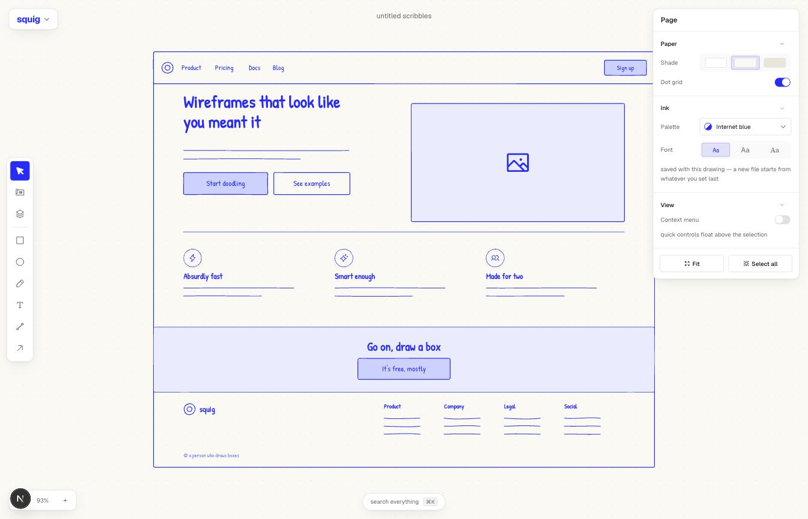
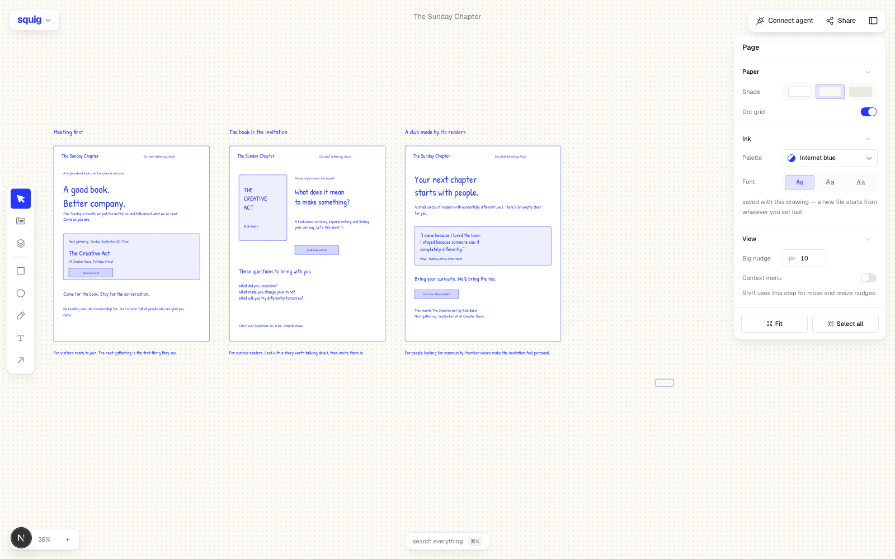

# scrawl

A modern wireframing canvas for people who think by drawing, with AI built in.
Like Excalidraw or tldraw, but with real UI components and an AI agent that can
read and edit your canvas.

**[Try it live at scrawl.sh →](https://scrawl.sh)**



Open Figma and you get sucked into high fidelity. Open tldraw and you're
hand-drawing every button from scratch. scrawl sits in between: an infinite
canvas where you drag in real UI components, but everything renders as a
hand-drawn sketch.

The sketchy look is the whole point. It's a napkin, not a mockup — nothing
looks decided, so people give feedback on the idea instead of the corner
radius, and you can try a layout three ways in the time one polished version
takes.

## What's in it

**Infinite canvas.** Pan, zoom, multi-select, marquee, smart-guide snapping,
keyboard nudge, undo/redo. Everything you'd expect.

**A real component library.** The shadcn/ui vocabulary — buttons, inputs,
selects, switches, tables, dialogs, tabs, nav, sidebars — plus blocks (heroes,
pricing, FAQ, AI chat, checkout, kanban) and whole screen templates.

**Everything is a component with variants.** Drop a button, and the inspector
flips it: icon left, icon right, size, filled or outline. It stays a component
while you do that — you're switching variants, not editing shapes.

**Break apart when you need to.** If no variant covers what you want, break the
component and its pieces become editable primitives. One-way, on purpose.

**⌘K searches everything.** Tools, actions, and every component and block, in
one sheet. Enter drops it in the middle of your view.

**Paste whatever you've got.** ⌘V takes the clipboard and puts it where the
pointer is: a screenshot to wireframe around, a paragraph of copy, or layers
copied out of another scrawl tab. Pictures land as themselves inside a drawn
frame — a reference you can't read is no reference — and get shrunk on the way
in, so a retina screenshot doesn't eat the drawer.

**Your files stay in your browser.** Every document autosaves as you draw, and
the file menu keeps a list of the recent ones to open again. New file starts a
new document rather than painting over the last one. The drawer holds the last
forty; past that, and when the browser runs out of room, the oldest ones go.
Local files need no accounts or cloud — clearing site data clears them, so
Export a copy (`⇧⌘S`) is there when a file matters.

## Keyboard

Figma's, so your hands already know it. `?` opens the full list in the app.

| | |
|---|---|
| `V` `R` `O` `P` `T` `L` | select, rectangle, ellipse, draw, text, arrow |
| `C` / `B` | components / blocks panel |
| `⌘K` / `⌘/` | search everything (`⌘K` over text links it instead) |
| `⌘Z` / `⇧⌘Z` | undo / redo |
| `⌘D`, `⌥`-drag | duplicate |
| `⌘C` `⌘X` `⌘V` / `⇧⌘V` | copy, cut, paste at cursor / paste in place |
| `⌘G` / `⇧⌘G` | group / ungroup — groups can nest; ungroup detaches an instance |
| `⌥⌘B` | detach instance |
| `⌘`-click, double-click | deep-select / step one level into a group |
| `⌘]` / `⌘[` | bring forward / send backward |
| `⌥⌘]` / `⌥⌘[` (or `]` / `[`) | bring to front / send to back |
| `⇧H` / `⇧V` | flip horizontal / vertical |
| `⌘B` `⌘I` `⌘U` | bold, italic, underline |
| `⌘S` / `⇧⌘S` | save to this browser / export a copy |
| arrows (`⇧` for the big nudge) | move by 1px / the custom big nudge (10px by default) |
| `⌘`-arrows (`⇧` for the big nudge) | resize by 1px / the custom big nudge |
| space-drag, middle-drag | pan |
| `⌘+` / `⌘-`, `⌘`-scroll | zoom the canvas, never the browser |
| `⇧0` `⇧1` `⇧2` | 100%, fit, selection |
| `⌘\` | hide the interface |

## Running it

```bash
pnpm install
pnpm dev
```

The local canvas needs no environment variables, database, or accounts — those
documents live in browser storage. Browser agents can edit the open tab, and
the optional local companion saves to a chosen disk file; see Scrawl for agents
below. `pnpm test` type-checks and runs every
suite under `scripts/test-*.ts`, and `pnpm test crop text` runs just the ones
whose names match. `pnpm verify` is lint, test and build in one go — the thing
to run before you push.

## How it's put together

Documents are a flat map of nodes on an infinite plane. Groups—including
subgroups—are hierarchy paths stamped onto those nodes rather than container
nodes, so there is still no layout nesting or flow layout. A node is a
component instance, a shape, a freehand stroke, text, or an arrow.

Components never render to DOM. Each one is a `ComponentDef` whose `render()`
returns an array of drawing primitives (`rect`, `line`, `text`, `icon`, …),
which the canvas draws through [rough.js](https://roughjs.com) into SVG. That
one indirection buys a lot: previews in the panel, ⌘K thumbnails, and
break-apart all reuse the exact same primitives the canvas draws.

Icons are Phosphor paths, rendered crisp rather than roughened — at 14px the
wobble just reads as mush.

To add a component, write a `ComponentDef` and add it to an array. See
[`lib/library/AUTHORING.md`](lib/library/AUTHORING.md).

```
app/                     the single page (and /kitchen-sink)
app/mcp/route.ts         explains the move to local MCP
app/api/v1/              read-only recovery of old online canvases
components/canvas/       canvas, interactions, rough.js renderer
components/chrome/       rail, panels, inspector, ⌘K, menus
components/agent/        connect an agent to this canvas, and stay in sync
lib/doc.ts               the document as a value: read, build, change, write
lib/store.ts             zustand doc state + history
lib/files.ts             the local file drawer: autosave, recents, prefs
lib/agent-bridge.ts      window.scrawl, the same API from the console
lib/agent/               local file service, schemas, engine, merge and render
lib/sketch/              drawing primitives + Phosphor icons
lib/sketch/paths.ts      primitives to rough.js paths
lib/sketch/svg.ts        a drawing as SVG, with no DOM in the room
lib/library/             every component and block definition
lib/canvas/snap-engine   alignment/snapping math
scripts/scrawl.ts         the CLI
scripts/test.ts          the test runner, over scripts/test-*.ts
scripts/harness.ts       the four lines of test framework there are
```

## Stack

Next.js, React, TypeScript, Tailwind, shadcn/ui for the tool's own chrome,
rough.js for the sketch rendering, Phosphor for icons.

## Contributing

Pull requests are welcome — [CONTRIBUTING.md](CONTRIBUTING.md) covers the
setup, what tends to get merged, and how to add a component, which is the
easiest place to start. If you're about to spend real time on something, open
an issue first.

## License

[MIT](LICENSE) © Sohail Khan ([me.jscrate.dev](https://me.jscrate.dev)).
Based on [squig](https://github.com/pablostanley/squig) by Pablo Stanley.

## Scrawl for agents



Bring your own agent to the canvas you already have open. **Connect agent**
copies instructions for an agent with access to that existing browser tab.
It checks the document ID and edits with `window.scrawl` or supported WebMCP
tools. Human and agent edits appear together and save automatically in
browser storage. No download, installation or companion is needed. Opening
the website in another browser profile does not bring the drawing with it.

For a chosen `.scrawl.json` file, the optional companion runs on your computer,
opens the full editor at a loopback address, and gives agents MCP and HTTP
tools for that same file. Components, batch edits, variations, notes, comments,
history, text measurement, SVG and PNG rendering all run locally.

From a clone of this repository, with Node.js 24 and pnpm 10:

```bash
pnpm install --frozen-lockfile
pnpm build:local
pnpm scrawl serve /absolute/path/homepage.scrawl.json
```

Open the local editor URL printed by the command and use **Connect agent**
for the session's connection details. A missing file is created; an existing
file is opened. Keep the process running while you work. For an MCP client
that launches its own process, use the direct Node configuration in
[the MCP guide](https://scrawl.sh/docs/mcp). Run one companion per file.

If you choose to move a browser drawing into a companion session,
export a `.scrawl.json` copy first, then open that saved file with the companion.
Browser storage and a file on disk are separate: a browser-only drawing is
not automatically linked to a downloaded copy.

There is no signup, cloud canvas storage, or Scrawl API key. Local history is
bounded to 50 snapshots and 16 MiB per file. Your agent still uses its own
model provider and account; its normal data handling and charges apply.
The Scrawl website still needs hosting, but agent saves and renders do not use
a public Scrawl backend. Existing online canvases have a temporary read-only
recovery path so their owners can export local copies.

- [Agent guide](docs/agents.md): local files, live MCP sessions and the browser API.
- [Architecture](docs/agent-architecture.md): persistence, concurrency and local access.
- [File format](docs/format.md): the portable document model.
- [Complete agent docs](https://scrawl.sh/llms-full.txt): tools, setup and limits.
- [Plugin](plugins/scrawl): an optional wireframing workflow and local setup skill.

Install the workflow plugin from this repository:

```bash
codex plugin marketplace add .
codex plugin add scrawl@scrawl-plugins
```

The plugin guides the agent to continue your open canvas or selected local
file. For a browser invitation, no runtime setup is needed. It does not
register a cloud server or bundle the application runtime; keep a local
Scrawl checkout only when using the companion for a disk file. No npm CLI
package is published by this repository. Agents without MCP can use the
companion's local HTTP API, the direct file CLI, or `window.scrawl` in an open tab.
